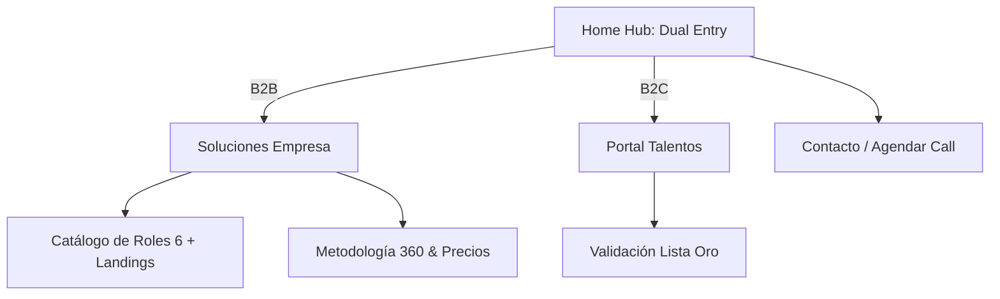

# Paquete de Referencia de Reconstrucción: TalentSync360 (v2)

Este documento es el plano técnico final para la reconstrucción de la web. Separa la realidad actual de la visión propuesta y establece las bases para la ejecución en Phase 2.

---

## 1. Auditoría del Sistema Visual (Actual)

La web actual utiliza un diseño basado en **Dark Mode** con la paleta de colores de **Tailwind CSS (Slate)**.

### A. Paleta de Colores
| Uso | Color Hex | Clase Equivalente |
| :--- | :--- | :--- |
| **Fondo Principal** | `#020617` | `bg-slate-950` |
| **Superficie (Cards/Nav)** | `#0F172A` | `bg-slate-900` |
| **Primario (Acción)** | `#2563EB` | `bg-blue-600` |
| **Primario (Hover)** | `#1D4ED8` | `bg-blue-700` |
| **Bordes/Divisores** | `#1E293B` | `border-slate-800` |
| **Texto H1/H2** | `#F8FAFC` | `text-slate-50` |
| **Texto Body** | `#94A3B8` | `text-slate-400` |

### B. Tipografía y Espaciado
- **Fuente**: `Inter`, `Geist` o sans-serif de sistema moderna.
- **H1**: `3rem` (48px) | `font-bold` | `tracking-tight`.
- **Body**: `1rem` (16px) | `leading-relaxed`.
- **Corner Radius**: 
    - Botones: `rounded-md` (8px).
    - Cards: `rounded-lg` (12px).
- **Spacing Estándar**:
    - Entre secciones: `py-24` (96px).
    - Padding interno cards: `p-6` (24px).

---

## 2. Inventario de Contenido Actual (Real Copy)

### A. Home Page (`/`)
*   **Hero**: 
    *   *Headline*: "Shortlists curadas de talento nearshore (LATAM) con inglés C1+"
    *   *Sub*: "Screening humano + pruebas prácticas + scorecards. Este mes: Graphic Designers (Argentina-first)."
*   **Proceso (Pipeline)**:
    1. "Definimos rol + KPIs: Roles low-friction con SOPs claros."
    2. "Screening humano + pruebas: C1+ confirmado, pruebas de rol y referencias."
    3. "Shortlist + onboarding: Listos para operar en ≤ 2 semanas."

### B. Empresas (`/companies`)
*   **Headline**: "Contratá talento LATAM C1+ con señal real."
*   **Tiers (Modelos)**:
    - **Oro (Elite)**: 3 reportes completos + evaluación técnica profunda.
    - **Plata (Nivel profesional)**: 3 scorecards + video presentación.
    - **Bronce (Backup)**: 3 scorecards básicos de velocidad.
*   **Roles**: Customer Support, VA, QA, Bookkeeper, Designer, Content Writer.

### C. Talentos (`/talents`)
*   **Headline**: "Tu perfil, validado para oportunidades globales."
*   **Pasos de Validación**: Voice Note (C1+) → Writing Test → Work Sample.
*   **Diferencial**: "No es una bolsa de trabajo: es un proceso de validación 360°."

---

## 3. Propuesta de Reconstrucción (Novedades)

Se propone mejorar la jerarquía visual y el flujo de navegación sin alterar el alma de la marca.

### A. Mejoras de Sistema Visual (Propuesta V1)
1.  **Acentos**: Introducir un color secundario para éxitos (ej: Emerald-500 `#10B981`) en los badges de "Verified".
2.  **Botones**: Normalizar 2 estilos claros:
    - *Primary Solido*: Blue-600.
    - *Secondary Ghost*: Slate-800 con borde sutil.
3.  **Interacciones**: Agregar micro-animaciones al hacer hover en las tarjetas de "Top Roles" (escala 1.02x).

### B. Mapa del Sitio Simplificado (V1 Concreta)

La nueva estructura elimina páginas redundantes y se enfoca en conversión directa:

### C. Cambios Clave en Copy (Propuesta)
- **Home**: Cambiar el enfoque de "Shortlists curadas" a "Contratá Talento Validado. Sin Fricción."
- **Companies**: Agrupar Roles y Tiers en una sola vista para facilitar la toma de decisión.
- **Footer**: Incluir links directos a las landings verticales por rol (SEO Boost).

---

> [!NOTE]
> Este documento cierra la fase de referencia. La siguiente acción será la **Reconstrucción Técnica** siguiendo estas especificaciones exactas. No se aceptarán desviaciones de colores o radios de borde sin previa consulta.
